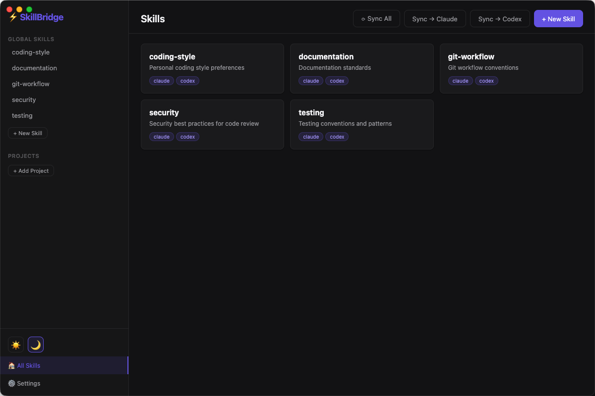
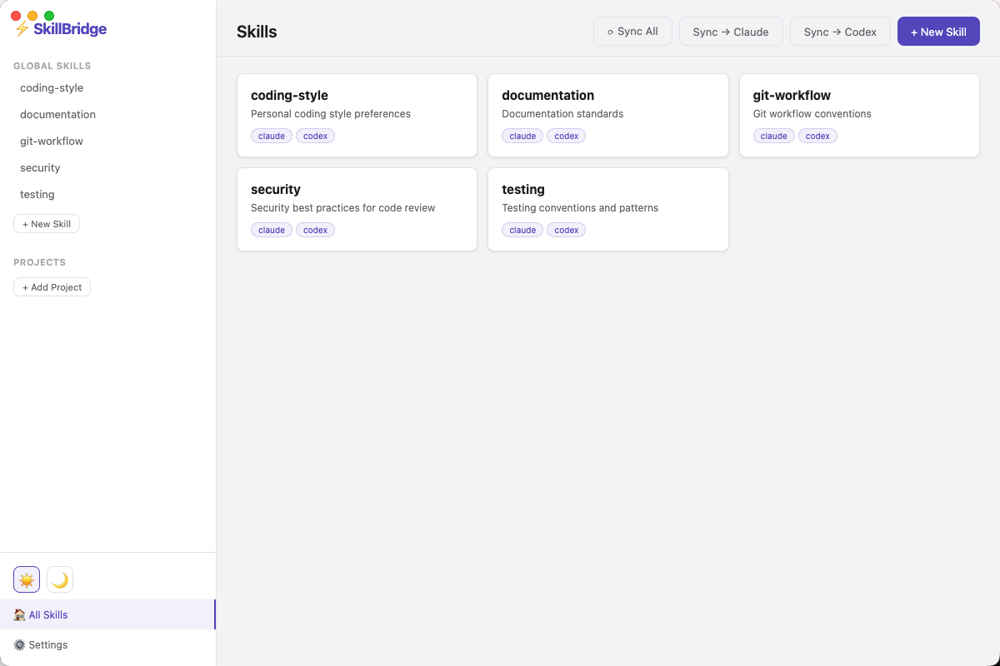

# SkillBridge Desktop

A native desktop app for managing your [SkillBridge](https://github.com/EdGuan/skillbridge) skills — view, edit, create, and sync skills across Claude Code and Codex CLI, all from one place.

Built with Electron + React (Vite).

## Screenshots

### Dark Theme


### Light Theme


## Features

- **📋 Skill Dashboard** — See all your global skills at a glance with name, description, and sync target badges
- **✏️ Skill Editor** — Click any skill to view and edit its markdown content, with a monospace editor and instant save
- **➕ Create & Delete** — Add new skills with name, description, and content; remove skills with confirmation
- **🔄 One-Click Sync** — Sync all skills to Claude Code and Codex CLI, or target each individually
- **📁 Project Tracking** — Register project directories to see which projects have per-project skills (CLAUDE.md / AGENTS.md)
- **🌗 Light & Dark Themes** — Toggle between themes with the sidebar controls; preference is saved across sessions
- **⚙️ Settings Panel** — Enable/disable sync targets, configure file paths, manage registered projects
- **🔌 Native Integration** — Reuses SkillBridge's core `lib/` modules directly — no duplicated logic

## Setup

```bash
cd desktop
npm install
```

## Development

```bash
npm run dev
```

Starts Vite dev server + Electron concurrently with hot reload.

## Build

```bash
npm run build
```

Packages the app using electron-builder. Output goes to `release/`.

## Architecture

```
desktop/
  electron/
    main.js          # Main process — imports ../lib/, exposes IPC handlers
    preload.js       # Context bridge → window.api
  src/
    main.jsx         # React entry
    App.jsx          # Root component, theme & state management
    components/
      Sidebar.jsx    # Navigation + theme toggle
      SkillList.jsx  # Skill card grid
      SkillEditor.jsx# Markdown editor view
      ConfigPanel.jsx# Settings & project management
      NewSkillModal.jsx
      Toast.jsx
    styles/
      global.css     # Theme variables + all styles
  vite.config.js
```

### IPC Bridge

The main process exposes these channels via `contextBridge`:

| Channel | Description |
|---------|-------------|
| `skills:list` | List all global skills |
| `skills:read` | Read a skill's content and metadata |
| `skills:create` | Create a new skill |
| `skills:update` | Update an existing skill |
| `skills:remove` | Delete a skill |
| `sync:run` | Sync skills to targets |
| `config:load` | Load configuration |
| `config:set` | Set a config value |
| `projects:list` | List registered project directories |
| `projects:add` | Register a project directory |
| `projects:remove` | Unregister a project directory |
| `dialog:openDirectory` | Native directory picker |

## Requirements

- Node.js 18+
- SkillBridge CLI (parent directory) with `lib/` modules
